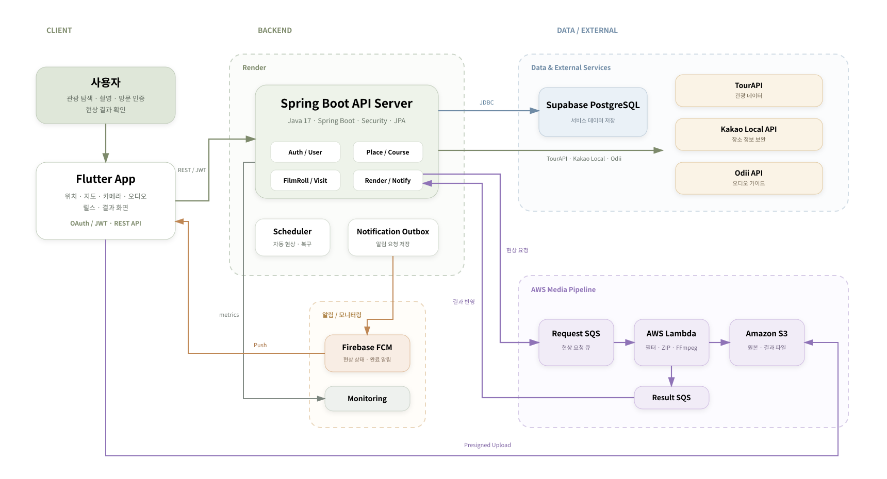

# Chaerok (채록)

> **충남 소도시의 여행 순간을 필름처럼 기록하고, 지역 이탈 후 감성 콘텐츠로 자동 현상하는 관광 기록 서비스**

📱 **2026 관광데이터 활용 공모전 웹·앱 개발 부문 참가**  
🍎 [App Store: 채록 - 충남 여행 기록](https://apps.apple.com/kr/app/%EC%B1%84%EB%A1%9D-%EC%B6%A9%EB%82%A8-%EC%97%AC%ED%96%89-%EA%B8%B0%EB%A1%9D/id6807424163) 출시  
▶️ **Google Play 심사 승인 · 프로덕션 출시 준비 중**

---

## 프로젝트 소개

**채록**은 충남 소도시를 여행하며 방문한 장소와 촬영한 순간을 하나의 **필름 롤**에 기록하고,   
여행이 끝난 뒤 사진과 릴스 형태의 콘텐츠로 자동 현상해주는 위치 기반 관광 기록 서비스입니다.

한국관광공사 **TourAPI**를 중심으로 지역 관광 정보를 제공하고, 부족한 음식점·카페 정보는 **Kakao Local API**로 보완합니다.  
사용자는 관광지·음식점·카페를 탐방하며 사진과 방문 기록을 쌓고,   
현상 조건을 만족한 뒤 지역을 이탈하면 서버가 필름 롤의 현상 가능 시점을 관리합니다.

현상 시에는 촬영한 사진에 지역별 필름 프리셋을 적용하고,   
**AWS SQS · Lambda · S3와 FFmpeg**를 활용한 비동기 미디어 파이프라인을 통해   
필터 사진 세트와 9:16 릴스 영상을 생성합니다.

---

## 주요 기능

### 🗺️ 관광 탐색 및 코스 추천

- TourAPI 기반 충남 관광지·음식점·카페 정보 제공
- Kakao Local API를 활용한 음식점·카페 정보 보완
- 관광지 · 음식점 · 카페 세 유형을 포함하는 소도시 탐방 코스 추천
- 장소 검색 및 관광지 상세 정보 제공

### 🎞️ 여행 기록 및 필름 롤

- 지역별 필름 롤 생성 및 최대 24장의 여행 사진 기록
- 방문 장소와 촬영 사진을 연결한 방문 기록 관리
- 관광지 · 음식점 · 카페 세 유형의 방문 진행도 관리
- 지역 이탈 및 현상 조건에 따른 자동 현상

### 📷 사진 및 필름 콘텐츠

- S3 Presigned URL 기반 사진 업로드
- 지역별 사전 제작 필름 프리셋 적용
- 필터 사진 세트 및 ZIP 결과 제공
- 이미지 특성을 분석한 프리셋 세부 보정

### 🎬 자동 현상

- SQS · Lambda 기반 비동기 미디어 처리
- FFmpeg 기반 9:16 릴스 영상 생성
- 현상 결과 상태 관리 및 다운로드 제공

### 🏛️ 유적지 콘텐츠

- TourAPI 기반 역사 테마 장소 판별
- Odii API 기반 오디오 가이드 조회
- 오디오 가이드가 없는 경우 TourAPI 관광 소개 정보로 대체

### 🔐 사용자 및 알림

- Kakao · Google · Apple OAuth 로그인
- JWT 기반 인증 및 토큰 재발급
- FCM 기반 푸시 알림
- 모바일 스토어 심사용 Review Mode

---

## 시스템 아키텍처



---

## 기술 스택

| 구분 | 기술 |
| --- | --- |
| **Backend** | Java 17, Spring Boot 3.5, Spring Data JPA, Spring Security |
| **Database** | Supabase PostgreSQL, Flyway |
| **Authentication** | Kakao OAuth, Google OAuth, Apple OAuth, JWT |
| **Tourism Data** | 한국관광공사 TourAPI, Kakao Local API, Odii API |
| **Cloud / Async** | AWS S3, AWS SQS, AWS Lambda |
| **Media** | Java2D, ImageIO, FFmpeg |
| **Notification** | Firebase Cloud Messaging |
| **Monitoring** | Spring Boot Actuator, Micrometer, Prometheus, Grafana |
| **API Docs** | Springdoc OpenAPI, Swagger |
| **Deployment** | Render, AWS |

---

## 핵심 구현

### 1. TourAPI 우선 · Kakao Local 보완 관광 데이터 통합

한국관광공사 데이터를 중심으로 일관된 관광 정보 체계를 유지하기 위해 TourAPI를 주 데이터 소스로 사용하고,   
부족한 음식점·카페 정보는 Kakao Local API로 보완합니다.

지역별 추가 장소 조회에서는 TourAPI 관광 자원 분류체계를   
채록의 `TOURISM` · `FOOD` · `CAFE_DESSERT` 유형으로 매핑한 뒤 필요한 수량을 우선 구성합니다.

TourAPI만으로 음식점·카페가 부족한 경우 Kakao Local API를 추가 호출하며,   
두 API의 결과를 합치는 과정에서는 장소명·주소를 정규화하고 좌표 간 거리를 비교하여 중복 장소를 제거합니다.

장소 검색 역시 TourAPI를 먼저 조회하고 충분한 결과를 얻지 못한 경우에만 Kakao Local API 결과를 추가합니다.

---

### 2. 세 가지 관광 유형을 보장하는 탐방 코스 추천

지역 대표 관광지를 앵커(Anchor)로 선택하고 주변의 음식점과 카페를 조합해 소도시 탐방 코스를 구성합니다.

```text
대표 관광지
    ↓
반경 2km 음식점 · 카페 탐색
    ↓ 결과 부족
반경 5km까지 탐색 범위 확장
    ↓
TOURISM + FOOD + CAFE_DESSERT
```

추천 결과는 `TOURISM` · `FOOD` · `CAFE_DESSERT` 세 유형이 모두 포함된 경우에만 완성된 코스로 제공합니다.

Kakao Local API에서 적절한 후보를 찾지 못한 경우 지역의 대표 장소 중 가장 가까운 동일 유형 장소를 대체 후보로 활용합니다.

---

### 3. OAuth + JWT 인증 구조

Kakao · Google · Apple을 하나의 OAuth 인증 흐름으로 처리하기 위해   
Provider별 Token Verifier와 Resolver 구조를 구성했습니다.

```text
OAuth ID Token 검증
→ 기존 사용자 여부 확인
→ 신규 사용자: Signup Token 발급
→ 약관 동의 및 회원가입
→ Access Token + Refresh Token 발급
```

Refresh Token은 원문을 DB에 저장하지 않고 Hash 값으로 관리하며,   
토큰 재발급 시 기존 Refresh Token을 폐기하고 새로운 토큰을 발급하는 Rotation 방식을 적용했습니다.

Apple 로그인에서는 nonce를 함께 검증하고,   
회원 탈퇴 시 Apple Revoke API와 연동하여 Provider 특성에 맞는 계정 처리 흐름을 구성했습니다.

---

### 4. 상태 기반 필름 롤 라이프사이클

필름 롤의 촬영부터 현상 완료까지를 상태로 관리하여 각 단계에서 허용되는 작업을 제한합니다.

```text
CAPTURING
    ↓
READY
    ↓
QUEUED
    ↓
PROCESSING
    ↓
COMPLETED

FAILED   : 동일 필름 롤 현상 재시도 가능
EXPIRED  : 조건 미충족 또는 결과 보관 기간 종료
```

클라이언트에서 지역 이탈이 확정된 후 서버는 관광지 · 음식점 · 카페 방문 여부와 업로드된 사진 존재 여부를 다시 검증합니다.

현상 조건을 충족하면 `exitedAt`과 현상 가능 시점을 기록하고,   
지정된 시점이 지난 필름 롤은 Scheduler가 기존 현상 파이프라인을 자동으로 실행합니다.

장기간 `CAPTURING` 상태로 남은 필름 롤 또한 Scheduler를 통해 정리하여 불완전한 데이터가 계속 누적되지 않도록 관리합니다.

---

### 5. S3 Presigned URL 기반 사진 업로드

촬영 이미지 전체가 Spring Boot 서버를 통과하지 않도록 S3 Presigned URL 기반 직접 업로드 방식을 사용합니다.

```text
Flutter
→ 업로드 URL 요청
→ Spring Boot
→ Presigned URL 발급
→ Flutter → S3 직접 업로드
→ 업로드 완료 요청
→ Spring Boot가 S3 객체 검증
```

서버에서는 업로드 완료 처리 시   
실제 S3 객체의 존재 여부와 크기, Content-Type을 확인한 뒤에만 사진을 `UPLOADED` 상태로 변경합니다.

이를 통해 이미지 바이너리가 애플리케이션 서버를 불필요하게 경유하지 않도록 하고,   
실제 S3 업로드 상태와 서버의 사진 상태를 일치시키도록 구성했습니다.

---

### 6. SQS · Lambda 기반 비동기 자동 현상

필터 처리와 FFmpeg 영상 생성은 CPU 사용량과 처리 시간이 큰 작업이므로 일반 API 요청과 분리했습니다.

지역별 프리셋은 고정된 기준으로 선택하고, 각 이미지의 밝기·장면 특성을 분석해 적용 강도를 세부 조정합니다.

```text
Spring Boot
→ Render Request SQS
→ AWS Lambda
→ S3 원본 다운로드
→ 지역 필터 적용
→ JPEG · ZIP 생성
→ FFmpeg 릴스 생성
→ S3 업로드
→ Render Result SQS
→ Spring Boot
```

Spring Boot는 RenderJob과 사진·필터 정보를 SQS에 전달하고, Lambda는 독립적으로 미디어 생성 작업을 수행합니다.

처리 결과는 별도의 Result SQS를 통해 다시 Spring Boot로 전달하여 `FilmRoll`, `Photo`, `RenderJob` 상태에 반영합니다.

---

### 7. 렌더링 멱등성 및 실패 복구

SQS 메시지는 중복 전달될 수 있고 Lambda 역시 재실행될 수 있으므로,   
동일 RenderJob이 여러 번 처리되는 상황을 고려해 설계했습니다.

Lambda는 렌더링 완료 후 `manifest.json`을 S3에 저장하고,   
동일 `renderJobId`가 다시 처리되면 Manifest를 확인해 이미 생성된 결과를 재사용합니다.

Spring Boot 결과 소비자에서도 RenderJob ID, FilmRoll, S3 경로, 사진 개수와 상태를 검증하여   
중복 또는 지연된 결과가 현재 상태를 잘못 덮어쓰지 않도록 처리합니다.

또한 일정 시간 이상 `CREATED` 상태에 머문 RenderJob을 Scheduler가 탐지하여 재처리하고,   
`FAILED` 상태의 필름 롤은 동일한 필름 롤을 기준으로 다시 현상할 수 있도록 구성했습니다.

---

### 8. Notification Outbox 기반 푸시 알림

비즈니스 처리 성공 여부가 FCM 전송 결과에 의존하지 않도록,   
알림 요청을 Outbox에 저장하고 별도의 Dispatcher가 비동기로 전송합니다.

```text
비즈니스 처리
→ Notification Outbox 저장
→ Scheduler
→ Dispatcher
→ Firebase FCM
→ 사용자 기기
```

사용자의 FCM Registration Token을 별도로 관리하며, 재등록과 등록 해제를 지원합니다.

---

## 운영 및 모니터링

- Render 기반 Spring Boot 애플리케이션 배포
- Supabase PostgreSQL 운영 데이터베이스 구성
- AWS S3 · SQS · Lambda 기반 미디어 처리 환경 구성
- Spring Boot Actuator · Micrometer · Prometheus · Grafana 기반 서버 메트릭 모니터링
- Render 환경 JVM 메모리 제한 및 Metaspace 관련 운영 이슈 분석·조정
- TourAPI 등 외부 API 지연 대응을 위한 Timeout 정책 조정
- `/api/health` 기반 서버 상태 확인
- App Store · Google Play 위치 기반 앱 심사용 Review Mode 및 테스트 환경 구성

---

## 테스트 및 검증

도메인 서비스와 외부 시스템 연동 경계를 중심으로 단위·통합 테스트를 구성했습니다.

- OAuth Provider별 Token 검증 및 인증 흐름 검증
- 사용자 조회·수정 및 회원 탈퇴 로직 검증
- TourAPI · Kakao 장소 조회 및 카테고리 매핑 검증
- 장소 검색·중복 제거 및 추천 코스 구성 검증
- 방문 기록 중복 방지 및 관광 유형 진행도 검증
- 필름 롤 상태 전이 및 지역 이탈 조건 검증
- 사진 업로드 및 S3 객체 검증
- RenderJob 요청 · 결과 처리 · 중복 결과 검증
- 렌더링 실패 및 복구 처리 검증
- Notification Outbox 및 FCM 전송 처리 검증
- Lambda 필터 · ZIP · 릴스 생성 파이프라인 검증

```bash
# Spring Boot
./gradlew clean test

# Render Lambda
./gradlew -p lambda/render clean test
```

---

## 한계 및 개선 방향

- TourAPI 등 외부 API 장애·지연에 대비한 Circuit Breaker · Retry 정책 고도화
- RenderJob 반복 실패에 대한 DLQ 및 재시도 정책 명확화
- 실제 운영 트래픽 기반 모니터링 지표와 알림 임계값 정교화
- 미디어 결과물 생성 시간과 비용을 기반으로 한 Lambda 처리 성능 최적화
- 관광지 및 사용자 확대에 따른 장소 데이터 조회·캐싱 전략 검토